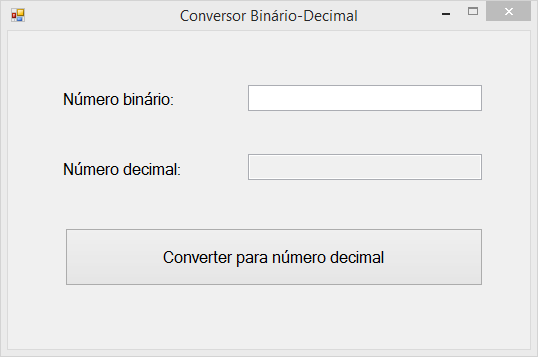
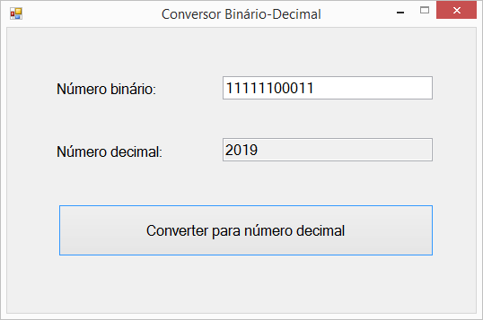

# Conversor Binário-Decimal

Muitas pessoas, principalmente aquelas que trabalham em Tecnologia da Informação/Computação, ou então são estudantes da área, veem com frequência números em base binária, isto é, que possuem somente os dígitos 0 e 1 em sua composição.

E algumas vezes elas podem encontrar dificuldades em saber o número decimal que aquilo representa.

Para resolver tal problema, este software foi desenvolvido, o Conversor Binário-Decimal.

Este software possibilitará a realização de conversões de números em base binária para números em base decimal.

## Funcionamento

Caso queira saber o número decimal equivalente a um binário, basta apenas:

	1. Digitar o número binário que quer saber o eqivalente decimal no campo respectivo, e;
	2. Apertar o botão para realizar a conversão.

E em apenas 2 passos você descobre o valor decimal do respectivo binário, e assim a sua dúvida é resolvida.

Abaixo, nas imagens, você vê o exemplo de funcionamento do software, tentando saber qual é o número decimal equivalente do binário `11111100011`:

## Imagens do Software

## Uso

Para usar a aplicação:

  1. Fazer o download: Duas formas de baixar o sistema:
  
    - Baixando o ZIP diretamente do repositório, ou;
    - Fazendo o clone deste repositório, através do comando:
    git clone https://github.com/rt-oliveira/Conversor-Binario-Decimal.git
    
  2. Compilar a aplicação: Para compilar a aplicação, e gerar o executável *exe*, basta dar um dos seguintes comandos na pasta da aplicação:
    `msbuild Conversor Binário-Decimal.sln`, ou,
	`msbuild Conversor Binário-Decimal.csproj`
	
  3. O arquivo *exe* será gerado com esse comando, e;
  
  4. Está pronto para ser usado o Conversor Binário-Decimal.
  
## Contribuições
  
  - Para contribuir:
    1. Crie um fork deste repositório
    2. Crie uma branch para fazer as alterações
    3. Faça as alterações necessárias
    4. Faça um commit, e envie para seu repositório remoto
    5. Crie um Pull Request